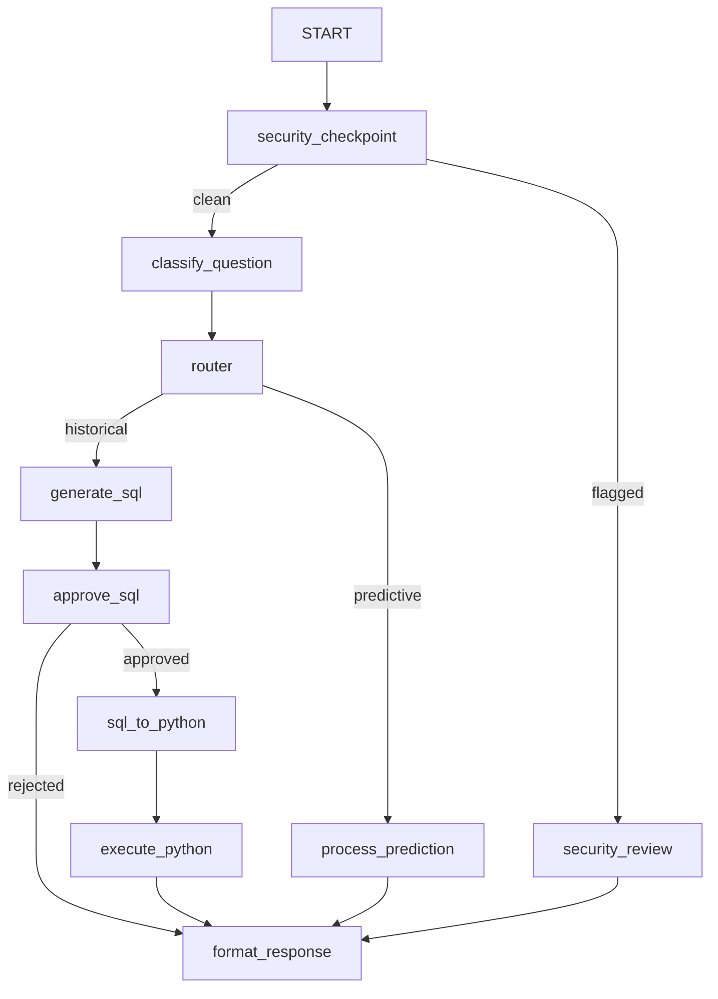

# Shopify Data Science Agent: A Secure, Graph-Based Assistant with HITL and ML Churn Modeling

## Subtitle
*Designing a Robust, Production-Ready Data Agent Using ADK 2.0 Workflows, STRIDE Security Checkpoints, and Local Pandas Execution*

---

## 1. Core Concept and Value

### Central Idea & Innovation
The **Shopify Data Science Agent** is an autonomous assistant designed to democratize data-driven decision-making for e-commerce merchants. Traditionally, extracting business intelligence requires manual SQL writing, manual code creation, or exporting files to external spreadsheets. The central idea of this project is to provide a single natural language interface that can seamlessly bridge two complex operations:
1. **Ad-hoc Historical SQL Reporting**: Answering questions like *"How many customers did I onboard in the last 3 months?"* by generating query logic and translating it into Python for execution.
2. **Predictive Analytics (Machine Learning)**: Forecasting customer behavior, such as predicting customer churn using a locally trained classifier.

### Value to the Track
This solution focuses on **innovation, developer productivity, and system safety**. Rather than acting as a simple wrapper around a chatbot, the agent orchestrates the entire lifecycle of query compilation, safety verification, and execution. 

The value is clear:
*   **Operational Safety**: It executes arbitrary code safely without exposing the database directly to prompt injections.
*   **Self-Contained ML**: It trains its own models locally inside the workflow graph without requiring pre-trained endpoints.

### Agent Centrality
The use of AI agents is central and meaningful to this solution:
*   **Reasoning-Based Routing**: An LLM agent determines the semantic intent of the query and routes the request down the correct path (structured querying vs. training/inference).
*   **Logical Translation**: LLM agents act as software engineering translators, mapping abstract relational databases (SQL) into functional programming code (Python/Pandas).

---

## 2. Multi-Agent Architecture (Number of Agents and Roles)

The system is configured as an ADK 2.0 Graph Workflow containing **1 master Workflow agent** that orchestrates **3 specialized LLM sub-agents** and **4 helper/HITL nodes**.



### The 4 Agents and Their Roles

1.  **Master Workflow Agent (`shopify_data_science_workflow`)**
    *   **Type**: `Workflow` (BaseAgent subclass)
    *   **Role**: Serves as the central state-machine, router, and supervisor. It holds the session context, coordinates node transitions, and manages execution safety across all execution paths.
2.  **Question Classifier Agent (`classify_question`)**
    *   **Type**: `LlmAgent` (single-turn)
    *   **Role**: Analyzes the clean user query and categorizes it strictly according to a Pydantic schema: `historical` or `predictive`.
3.  **Shopify Database Engineer Agent (`generate_sql`)**
    *   **Type**: `LlmAgent` (single-turn)
    *   **Role**: Acts as a database administrator. It translates the natural language business question into a raw SQL query optimized for typical Shopify schema structures.
4.  **Python Data Scientist Agent (`sql_to_python`)**
    *   **Type**: `LlmAgent` (single-turn)
    *   **Role**: Converts the approved SQL query string into executable Python Pandas code. It is given context about the columns and types in the pre-loaded DataFrame (`df`) and assigns the final result to `result`.

---

## 3. Security Features & Threat Mitigation

Running an autonomous code-executing agent exposes a system to significant attack surfaces. The architecture incorporates several built-in security features:

### A. PII Scrubbing (Information Disclosure)
Before the user's message is sent to any LLM or written to session logs, the `security_checkpoint` runs regular expression checks to sanitize sensitive data:
*   **SSNs**: Replaced with `[REDACTED_SSN]` using `\b\d{3}-\d{2}-\d{4}\b`.
*   **Credit Cards**: Replaced with `[REDACTED_CC]` using `\b(?:\d[- ]?){13,16}\b`.
Redaction logs are recorded in the state and displayed as warning notes on the approval request.

### B. Prompt Injection Defense (Tampering)
If a user attempts to alter or delete database files (e.g., *"Please delete the csv file"*), the entry checkpoint runs keyword matching on destructive actions:
*   **Verbs**: `delete`, `drop`, `truncate`, `wipe`, `overwrite`, `destroy`, `alter`.
*   **Nouns**: `data`, `dataset`, `file`, `csv`, `table`, `database`.
Any match bypasses the LLM nodes entirely and routes directly to the `security_review` HITL node, blocking execution until an administrator approves.

### C. Human-in-the-Loop (HITL) Gate & Text Overrides
Critical operations (SQL query execution and prompt-injection overrides) are guarded by human approval. The nodes yield `RequestInput` to pause execution. 
To ensure usability:
*   If users respond via interactive UI cards, standard ADK resumption handles the execution.
*   If users type `"approve"` or `"reject"` in the main chat input, a state-delta override captures this at the entry checkpoint (`user_approval_override`), allowing the graph to automatically resume.

### D. Replay Safety & State Isolation
To prevent information leakage between consecutive questions in the same chat thread, the SQL approval node yields a state delta that clears the `pending_sql` cache and any text overrides once they have been consumed:
```python
state_delta = {"pending_sql": None}
if "user_approval_override" in ctx.state:
    state_delta["user_approval_override"] = None
```

---

## 4. Machine Learning Churn Pipeline (Type 2)

For predictive questions, the workflow bypasses SQL and executes a local machine learning training pipeline in `process_prediction`:

1.  **Date Span Verification**: Computes the date range of the dataset. If the total span is under 7 days, the agent aborts to prevent overfitting:
    > *"Insufficient data to generate machine learning model"*
2.  **Feature Engineering**: Groups orders by `customer_id` and calculates recency, lifetime, spending totals, and purchase counts.
3.  **Model Training**: Trains a local `LogisticRegression` model from `scikit-learn`. Customers are labeled as churned if their recency exceeds 20 days.
4.  **Reporting**: Outputs high-risk customers, ordering details, and recency in a clean markdown table.

---

## 5. SQL-to-Python Execution Pipeline (Type 1)

When a query is approved, the system converts the SQL into Python and runs it against the local CSV dataset.

### Timezone Normalization
To prevent type crashes (e.g. comparing timezone-aware UTC dates in CSVs with timezone-naive timestamps in Python), the system normalizes the dataset's datetime columns to timezone-naive datetimes in both execution nodes:
```python
df["order_placed_timestamp"] = pd.to_datetime(df["order_placed_timestamp"]).dt.tz_localize(None)
```
The prompt template for `sql_to_python` explicitly defines `order_placed_timestamp` as `datetime, timezone-naive`, guaranteeing error-free comparison logic.

---

## 6. Key Results & Conclusion

The Shopify Data Science Agent successfully combines **natural language accessibility** with **stringent security controls** and **automated machine learning**. 

By orchestrating modular LLM nodes inside an ADK 2.0 graph workflow and combining them with Python data-science libraries, the project demonstrates a safe, predictable pattern for deploying autonomous analytical agents in enterprise data settings.
