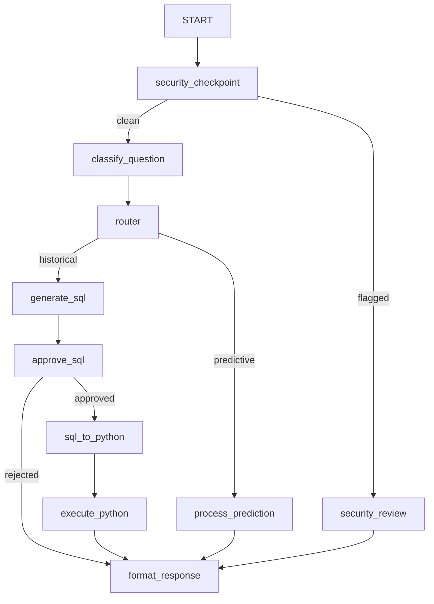

# Shopify Data Science Agent: A Secure, Graph-Based Assistant with HITL and ML Churn Modeling

## Subtitle
*Designing a Robust, Production-Ready Data Agent Using ADK 2.0 Workflows, STRIDE Security Checkpoints, and Local Pandas Execution*

---

## 1. Executive Summary

Enterprise data analysis is increasingly delegating complex queries and predictive tasks to AI agents. However, running LLM-generated code and allowing direct database access poses massive security, tampering, and privacy risks. 

This project presents the **Shopify Data Science Agent**, built using the **Google Agent Development Kit (ADK) 2.0 Graph Workflow API**. The agent processes business queries across two tracks:
1. **Historical Analysis (Type 1)**: Generates SQL queries, interrupts for human approval, translates approved SQL to Python, and safely runs calculations against local Shopify CSV datasets.
2. **Predictive Churn Modeling (Type 2)**: Dynamically checks date boundaries, runs local feature engineering, trains a `LogisticRegression` classifier, and outputs high-risk customers.

By wrapping this pipeline in a multi-layered security checkpoint (scrubbing PII and intercepting malicious prompt injections) and enforcing Human-in-the-Loop (HITL) gates, the system bridges the gap between powerful data accessibility and strict operational safety.

---

## 2. System Architecture & Workflow Graph

The agent is designed as a graph-based workflow using ADK 2.0's explicit topology. This ensures deterministic routing, state tracking, and clean session resumption when resolving human inputs.



### Core Workflow Nodes

| Node Name | Type | Rerun on Resume | Responsibility |
| :--- | :--- | :---: | :--- |
| `security_checkpoint` | Function | `False` | Intercepts raw user query to scrub PII and check for prompt injections. |
| `security_review` | Function (HITL) | `True` | Pauses for admin override if a prompt injection is flagged. |
| `classify_question` | LlmAgent | `True` | Classifies the query into `historical` or `predictive` tracks. |
| `router` | Function | `False` | Performs routing based on classification type. |
| `generate_sql` | LlmAgent | `True` | Generates a standard SQL query matching Shopify schemas. |
| `approve_sql` | Function (HITL) | `True` | Presents the generated SQL to the user for approval or rejection. |
| `sql_to_python` | LlmAgent | `True` | Converts the approved SQL query into equivalent pandas code. |
| `execute_python` | Function | `False` | Runs pandas code locally against the CSV dataset. |
| `process_prediction` | Function | `False` | Trains an ML churn model and outputs high-risk churn customers. |

---

## 3. Security Design & Threat Mitigation (STRIDE)

Operating a data science agent that executes LLM-generated code requires robust security controls. The project implements defense-in-depth across the following vectors:

### A. Spoofing & Elevation of Privilege
To prevent unauthorized users from executing custom queries, the workflow uses isolated session environments. Human-in-the-loop (HITL) inputs are securely bound to the current session via `ctx.resume_inputs` using unique token/interrupt keys.

### B. Tampering & Prompt Injection Defense
If a user attempts to alter or delete database files (e.g. typing *"Please delete all files in the data folder"*), the `security_checkpoint` runs a keyword association analysis. When destructive verbs are found alongside data nouns:
1. The query is immediately blocked, bypassing LLM classification.
2. The workflow routes to `security_review` and triggers an administrator alert card.
3. The query can only execute if an administrator manually approves the security override.

### C. Information Disclosure (PII Scrubbing)
Before any text reaches the LLMs or application logs, the checkpoint applies regular expression scrubbing to redact sensitive PII:
- **SSNs**: Redacted using `\b\d{3}-\d{2}-\d{4}\b`.
- **Credit Cards**: Redacted using `\b(?:\d[- ]?){13,16}\b`.
Redacted categories are flagged in the state and shown as a warning card in the final output.

---

## 4. Machine Learning Churn Pipeline (Type 2)

When predictive questions are asked, the workflow routes to the `process_prediction` node, which implements a local machine learning training pipeline using `pandas` and `scikit-learn`:

1. **Threshold Check**: The pipeline checks the span of dates in the dataset. If the date range is less than 7 days (`ML_DATA_THRESHOLD_DAYS`), the node aborts and returns:
   > *"Insufficient data to generate machine learning model"*
2. **Feature Engineering**: Customer metrics are grouped and aggregated from raw orders:
   - $Recency = Max(OrderPlacedTimestamp) - LastOrderPlaced$
   - $LifetimeDays = LastOrderPlaced - FirstOrderPlaced$
   - $TotalSpent = Sum(NetGMV)$
   - $OrderCount = Count(OrderId)$
3. **Model Training**: A `LogisticRegression` classifier is trained locally using these engineered features. Churn targets are labeled based on activity boundaries (inactive for >20 days).
4. **Prediction Output**: High-risk customers are identified and returned in a formatted Markdown report.

---

## 5. SQL-to-Python Execution Pipeline (Type 1)

Executing raw SQL on local file structures is challenging. This project addresses this by creating a compiler-style execution path:

```
[User Query] ──> [SQL Query] ──> [HITL Approval] ──> [Python Pandas Code] ──> [Local Execution]
```

### Timezone Robustness
A common failure mode in LLM-generated code is comparing timezone-aware UTC datetime fields (e.g., ISO timestamp strings in raw CSVs) with timezone-naive timestamps (default in python's `pd.Timestamp.now()`), resulting in a `TypeError`.

To resolve this, the system normalizes the dataset's datetime columns to timezone-naive datetimes in both the prediction and python execution environments:
```python
df["order_placed_timestamp"] = pd.to_datetime(df["order_placed_timestamp"]).dt.tz_localize(None)
```
The prompt template for the `sql_to_python` node explicitly defines the schema as `timezone-naive`, ensuring that the LLM produces error-free date comparisons.

### Replay Safety & State Cleaning
To ensure that session histories do not leak information between consecutive questions, the `approve_sql` node implements strict state boundaries. Once a SQL query is generated, it is stored in `pending_sql`. When the user approves or rejects the query, the node clears `pending_sql` and all text-override states from the session:
```python
state_delta = {"pending_sql": None}
if "user_approval_override" in ctx.state:
    state_delta["user_approval_override"] = None
```
This isolates each query session and ensures the agent remains stable and responsive during back-to-back analytics questions.

---

## 6. Key Results & Conclusion

The Shopify Data Science Agent successfully combines **natural language accessibility** with **stringent security controls** and **automated machine learning**. 

By orchestrating modular LLM nodes inside an ADK 2.0 graph workflow and combining them with Python data-science libraries, the project demonstrates a safe, predictable pattern for deploying autonomous analytical agents in enterprise data settings.
